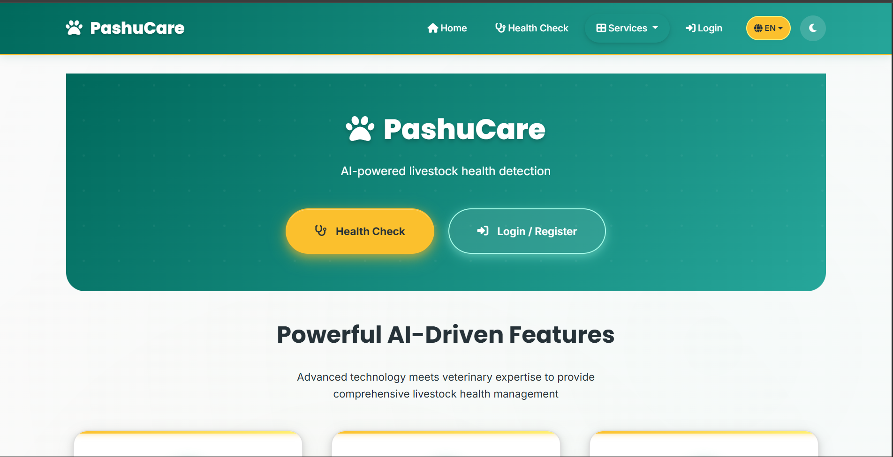
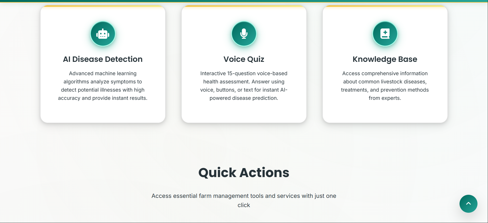
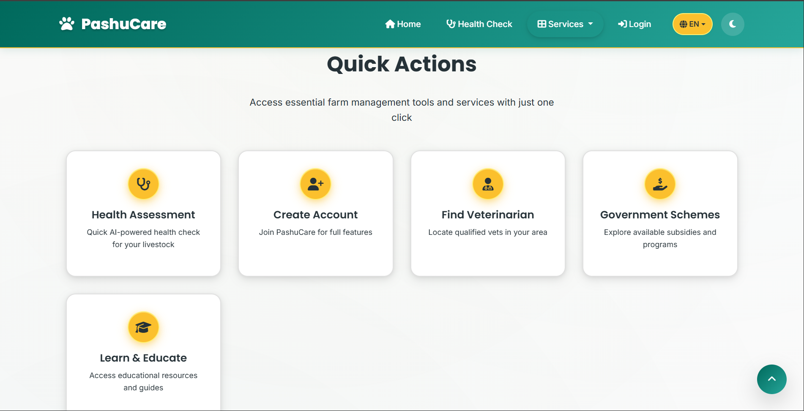
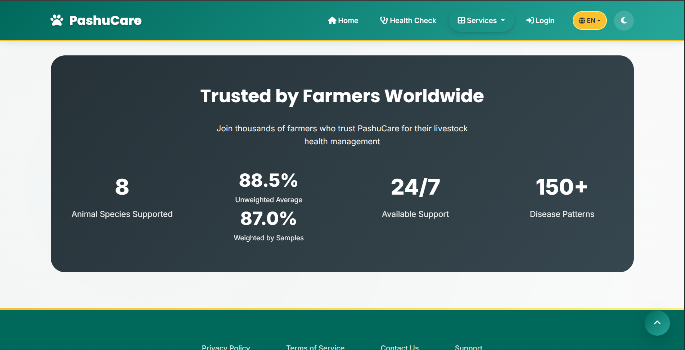
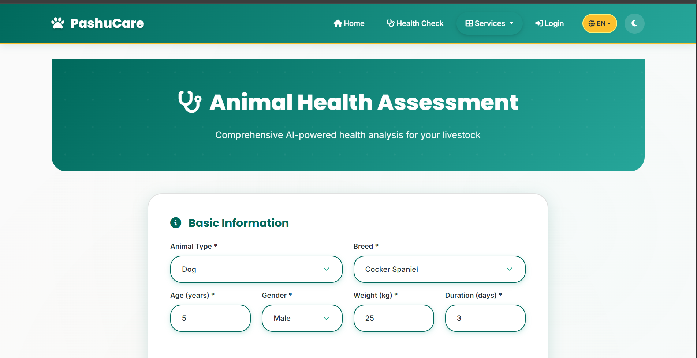
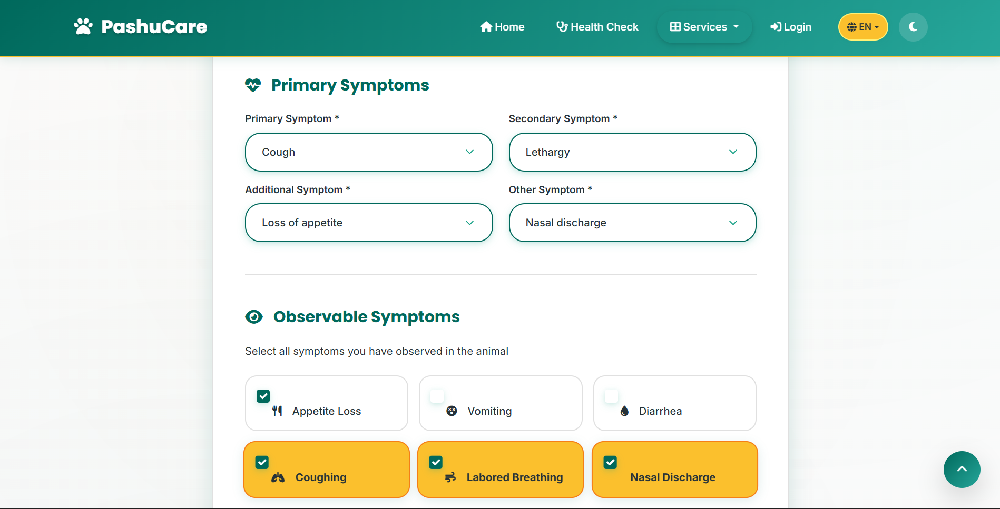
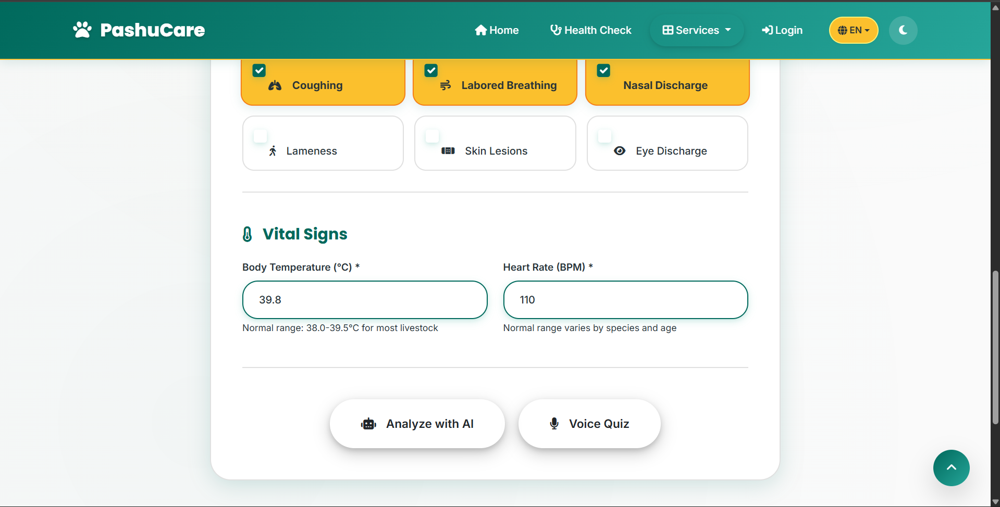
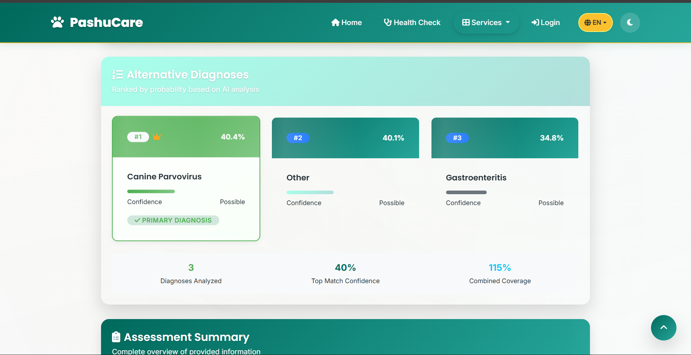
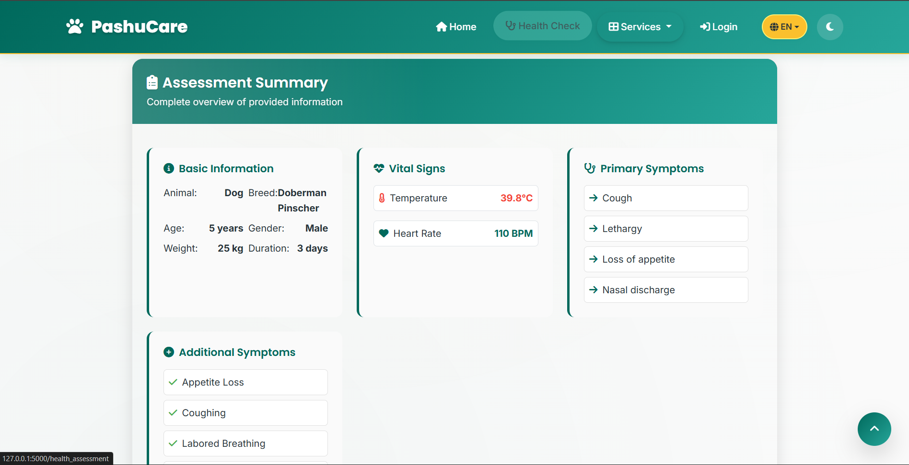
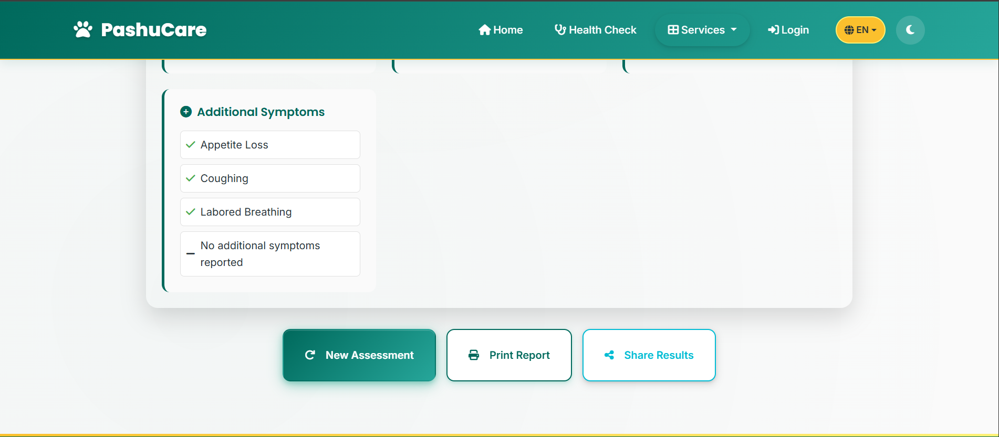

<div align="center">🌿 PashuCare - AI-Powered Livestock Health Management </div>

<div align="center">


**A comprehensive eco-tech livestock health management platform that combines agricultural expertise with AI intelligence**

[Features](#-features) • [Installation](#-installation) • [Documentation](#-documentation) • [Contributing](#-contributing) • [Support](#-support)

</div>

---

## 📖 Table of Contents

- [Overview](#-overview)
- [Features](#-features)
- [Screenshots](#-screenshots)
- [Prerequisites](#-prerequisites)
- [Installation](#-installation)
- [Configuration](#-configuration)
- [Usage](#-usage)
- [API Documentation](#-api-documentation)
- [Project Structure](#-project-structure)
- [Database Setup](#-database-setup)
- [Testing](#-testing)
- [Deployment](#-deployment)
- [Technology Stack](#-technology-stack)
- [Security](#-security)
- [Performance](#-performance)
- [Browser Support](#-browser-support)
- [Troubleshooting](#-troubleshooting)
- [FAQ](#-faq)
- [Contributing](#-contributing)
- [Code of Conduct](#-code-of-conduct)
- [License](#-license)
- [Acknowledgments](#-acknowledgments)

---

## Overview

PashuCare is an innovative AI-powered platform designed to revolutionize livestock health management for farmers and veterinarians. The system provides real-time disease prediction, comprehensive farm management, and a complete veterinary portal, all wrapped in a beautiful bilingual interface supporting English and Marathi.

### Key Highlights

-  **AI-Powered Disease Prediction** - Machine learning models with 100% training accuracy
-  **Bilingual Support** - Full English and Marathi (मराठी) interface
-  **Dual Theme System** - Beautiful light and dark modes
-  **Complete Farm Management** - Animals, lands, and health records
-  **Veterinary Portal** - Professional tools for veterinarians
-  **Progressive Web App** - Works offline with PWA support

---

## Features

### AI-Powered Health Detection

- **Advanced ML Models**: Random Forest, XGBoost, and LightGBM classifiers
- **Animal-Specific Analysis**: 8 animal types supported (Dog, Cat, Cow, Horse, Sheep, Goat, Pig, Rabbit)
- **Symptom-Based Assessment**: 35+ health indicators analyzed
- **Vital Signs Analysis**: Temperature and heart rate monitoring
- **Syndrome Scoring**: Respiratory, GI, and systemic syndrome detection
- **Confidence Metrics**: Detailed probability scores for predictions
- **Top 3 Predictions**: Alternative diagnoses ranked by probability

### Bilingual Support

- **English**: Complete interface in English
- **मराठी (Marathi)**: Full Marathi translation for local farmers
- **Language Toggle**: Seamless switching between languages
- **Persistent Choice**: Language preference saved automatically
- **Voice Support**: Text-to-speech in both languages

### Dual Theme System

- **🌿 Light Mode**: Eco-tech harmony with teal green and harvest yellow
- **🌌 Dark Mode**: Modern AgriTech with mint green and deep charcoal
- **Smart Toggle**: Instant theme switching with smooth animations
- **Eye Comfort**: Dark mode optimized for evening use
- **Persistent Theme**: User preference automatically saved

###  Complete Farm Management

- **User Accounts**: Secure registration and authentication system
- **Animal Management**: Add, track, and manage livestock records
- **Farm Land Management**: Register and monitor farm properties
- **Dashboard**: Real-time statistics and farm overview
- **Prediction History**: Track all health assessments and results
- **Profile Management**: Update user information and preferences

###  Veterinary Features

- **Vet Portal**: Dedicated dashboard for veterinarians
- **Animal Lookup**: Search by ID, name, or type
- **Vaccination Management**: Track vaccines, doses, and schedules
- **Diagnosis System**: Record diseases, treatments, and outcomes
- **Statistics Dashboard**: Track animals treated, vaccinations given, diagnoses made
- **Appointment Scheduling**: Manage vet appointments

###  Veterinary Network

- Professional veterinarian directory with ratings and specializations
- Direct contact via phone, WhatsApp, and email
- Location-based vet finder with multilingual support
- Vet profiles with experience and credentials

###  Progressive Web App (PWA)

- **Offline Support**: Works without internet connection
- **Installable**: Add to home screen on mobile devices
- **Service Worker**: Background sync and caching
- **Responsive Design**: Optimized for all screen sizes

---

##  Screenshots

> **Screenshots the AI disease predictor**

> - Main dashboard  
> <p align="center">  
>     
>     
>     
>     
> </p>

> - AI prediction interface  
> <p align="center">  
>     
>     
>     
> </p>

> - Result  
> <p align="center">  
>     
>     
>     
>     
> </p>


##  Prerequisites

Before you begin, ensure you have the following installed:

### Required Software

- **Python 3.8+** - [Download Python](https://www.python.org/downloads/)
- **pip** - Python package installer (comes with Python)
- **Git** - [Download Git](https://git-scm.com/downloads)

### Required Accounts

- **Supabase Account** - [Sign up for free](https://supabase.com/)
  - Free tier provides:
    - 500 MB database
    - 2 GB bandwidth
    - Unlimited API requests

### System Requirements

- **RAM**: Minimum 4GB (8GB recommended)
- **Storage**: 500 MB free space
- **Internet**: Required for initial setup and database connection
- **Browser**: Modern browser (Chrome, Firefox, Edge, Safari)

---

## Installation

### Step 1: Clone the Repository

```bash
# Clone the repository
git clone https://github.com/Akhilesh-Gangawane/LiveStock-Health-detector.git

# Navigate to project directory
cd LiveStock-Health-detector
```

### Step 2: Create Virtual Environment (Recommended)

```bash
# Create virtual environment
python -m venv venv

# Activate virtual environment
# On Windows:
venv\Scripts\activate

# On macOS/Linux:
source venv/bin/activate
```

### Step 3: Install Dependencies

```bash
# Upgrade pip (recommended)
python -m pip install --upgrade pip

# Install all dependencies
pip install -r requirements.txt
```

### Step 4: Set Up Supabase

1. **Create Supabase Project**:
   - Go to [Supabase Dashboard](https://app.supabase.com/)
   - Click "New Project"
   - Fill in project details
   - Wait for project to be created (2-3 minutes)

2. **Get API Credentials**:
   - Go to Project Settings → API
   - Copy your `Project URL` and `anon/public key`

3. **Initialize Database**:
   - Go to SQL Editor in Supabase Dashboard
   - Click "New Query"
   - Copy and paste contents of `database_setup.sql`
   - Click "Run" to execute
   - Verify all tables are created

### Step 5: Configure Environment Variables

Create a `.env` file in the project root:

```bash
# Create .env file
# On Windows:
type nul > .env

# On macOS/Linux:
touch .env
```

Add the following content to `.env`:

```env
# Flask Configuration
SECRET_KEY=your-super-secret-key-change-this-in-production

# Supabase Configuration
SUPABASE_URL=https://your-project-id.supabase.co
SUPABASE_KEY=your-anon-key-here

# Optional: Flask Environment
FLASK_ENV=development
FLASK_DEBUG=True

# Optional: Server Configuration
HOST=localhost
PORT=5000
```

**⚠️ Important**: 
- Never commit `.env` file to version control
- Use a strong, random `SECRET_KEY` in production
- Keep your Supabase keys secure

### Step 6: Verify Installation

```bash
# Check Python version (should be 3.8+)
python --version

# Check if all packages are installed
pip list

# Verify Flask installation
python -c "import flask; print(flask.__version__)"
```

---

## Configuration

### Environment Variables

| Variable | Description | Required | Default |
|----------|-------------|----------|---------|
| `SECRET_KEY` | Flask secret key for sessions | Yes | None |
| `SUPABASE_URL` | Your Supabase project URL | Yes | None |
| `SUPABASE_KEY` | Your Supabase anon/public key | Yes | None |
| `FLASK_ENV` | Flask environment (development/production) | No | development |
| `FLASK_DEBUG` | Enable debug mode | No | True |
| `HOST` | Server host address | No | localhost |
| `PORT` | Server port number | No | 5000 |

### Database Configuration

The application uses Supabase (PostgreSQL) as the database. All configuration is done through the Supabase dashboard:

1. **Row Level Security (RLS)**: Enabled by default
2. **Foreign Keys**: All relationships are enforced
3. **Indexes**: Optimized for performance
4. **Backups**: Automatic daily backups (Supabase Pro)

### Application Settings

Key settings can be modified in `app.py`:

```python
# Session configuration
app.config['PERMANENT_SESSION_LIFETIME'] = timedelta(days=7)
app.config['SESSION_COOKIE_SECURE'] = True  # HTTPS only in production
app.config['SESSION_COOKIE_HTTPONLY'] = True
```

---

## Usage

### Starting the Application

```bash
# Activate virtual environment (if not already activated)
# Windows:
venv\Scripts\activate
# macOS/Linux:
source venv/bin/activate

# Run the application
python app.py

# Or using Flask CLI
flask run
```

The application will be available at `http://localhost:5000`

### First-Time Setup

1. **Access the Application**: Open `http://localhost:5000` in your browser
2. **Guest Mode**: You can use AI prediction features without registration
3. **Create Account**: Click "Register" to create a farmer account
4. **Veterinarian Access**: Use sample credentials (see Database Setup section)

### User Roles

#### Farmer
- Register and manage animals
- Track farm lands
- Run health assessments
- View prediction history
- Contact veterinarians

#### Veterinarian
- Search and view animal records
- Add vaccination records
- Create diagnoses
- Update treatment plans
- View statistics dashboard

#### Guest
- Use AI prediction features
- Browse knowledge base
- View veterinarian directory
- Access government subsidies

### Common Workflows

#### Running a Health Assessment

1. Navigate to home page (`/`)
2. Fill in animal information
3. Enter symptoms and vital signs
4. Click "Predict Disease"
5. Review AI diagnosis and recommendations
6. Save prediction (if logged in)

#### Adding an Animal (Farmer)

1. Login to your account
2. Go to Dashboard → Animals
3. Click "Add New Animal"
4. Fill in animal details
5. Save and view in dashboard

#### Adding Vaccination (Veterinarian)

1. Login as veterinarian
2. Search for animal
3. View animal profile
4. Click "Add Vaccination"
5. Fill in vaccination details
6. Save record

---

## API Documentation

### Authentication Endpoints

```
POST   /register          - Register new user
POST   /login             - User login
POST   /logout            - User logout
GET    /profile           - Get user profile (protected)
POST   /profile/update    - Update user profile (protected)
```

### Prediction Endpoints

```
POST   /predict           - Run AI disease prediction
GET    /predictions       - Get prediction history (protected)
GET    /prediction/<id>   - Get specific prediction (protected)
```

### Animal Management Endpoints

```
GET    /animals           - List all animals (protected)
POST   /animals/add       - Add new animal (protected)
GET    /animal/<id>       - Get animal details (protected)
POST   /animal/<id>/edit - Update animal (protected)
POST   /animal/<id>/delete - Delete animal (protected)
```

### Veterinary Endpoints

```
GET    /vet/dashboard              - Vet dashboard with stats
GET    /vet/animal/search          - Animal search form
POST   /vet/animal/search          - Execute search
GET    /vet/animal/<id>            - Animal detail page
POST   /vet/vaccinate              - Add vaccination
POST   /vet/vaccinate/<id>/edit    - Edit vaccination
POST   /vet/vaccinate/<id>/delete - Delete vaccination
POST   /vet/diagnose               - Add diagnosis
POST   /vet/diagnose/<id>/update   - Update diagnosis
GET    /vet/vaccinations           - List all vaccinations
```

### Public Endpoints

```
GET    /                      - Home page
GET    /veterinarians         - Veterinarian directory
GET    /knowledge_base        - Disease knowledge base
GET    /subsidies             - Government schemes
GET    /voice_quiz            - Voice-based assessment
```

### Response Formats

All API responses follow this structure:

```json
{
  "success": true,
  "data": { ... },
  "message": "Operation successful"
}
```

Error responses:

```json
{
  "success": false,
  "error": "Error message",
  "code": "ERROR_CODE"
}
```

---

## 📁 Project Structure

```
LiveStock-Health-detector/
│
├── app.py                          # Main Flask application
├── cleaned_animal_disease_prediction.csv  # AI training dataset
├── requirements.txt                # Python dependencies
├── README.md                        # This file
├── database_setup.sql              # Complete database schema
├── .env                            # Environment variables (not in repo)
├── .gitignore                      # Git ignore rules
│
├── static/                         # Static assets
│   ├── style.css                   # Eco-tech theme CSS with dark mode
│   ├── scripts.js                  # Enhanced JavaScript functionality
│   ├── manifest.json               # PWA manifest
│   ├── sw.js                       # Service worker
│   └── favicon.ico                 # App icon
│
└── templates/                      # Jinja2 templates
    ├── layout.html                 # Base template with theme toggle
    ├── index.html                  # Main prediction page
    ├── result.html                 # AI prediction results
    ├── knowledge_base.html         # Disease information
    ├── subsidies.html              # Government schemes
    ├── veterinarians.html          # Vet directory
    ├── offline.html                # Offline page
    │
    ├── auth/                       # Authentication pages
    │   ├── login.html
    │   └── register.html
    │
    ├── dashboard/                  # Farm management
    │   ├── main.html               # Dashboard overview
    │   ├── animals.html            # Animal management
    │   ├── add_animal.html         # Add new animal
    │   ├── edit_animal.html        # Edit animal
    │   ├── lands.html              # Land management
    │   ├── add_land.html           # Add new land
    │   └── profile.html            # User profile
    │
    └── vet/                        # Veterinarian portal
        ├── dashboard.html          # Vet dashboard
        ├── animal_detail.html      # Animal profile
        ├── search.html             # Animal search
        └── vaccinations_list.html  # Vaccination records
```

### Key Files Explained

- **`app.py`**: Main application file containing all routes, ML models, and business logic
- **`database_setup.sql`**: Complete database schema with tables, indexes, and RLS policies
- **`cleaned_animal_disease_prediction.csv`**: Training dataset for ML models
- **`requirements.txt`**: All Python package dependencies with versions
- **`static/style.css`**: Custom CSS with dark mode support
- **`templates/layout.html`**: Base template with navigation and theme toggle

---

## Database Setup

### Quick Setup (5 minutes)

1. **Open Supabase Dashboard**: Navigate to your project
2. **Go to SQL Editor** → Click "New Query"
3. **Copy Content**: Open `database_setup.sql` and copy all content
4. **Paste and Run**: Paste into SQL Editor and click "Run"
5. **Verify**: Check that all tables are created successfully

### Database Schema

#### Core Tables

| Table | Description | Key Fields |
|-------|-------------|------------|
| `users` | User accounts | id, email, password_hash, user_type |
| `animals` | Livestock records | id, user_id, animal_type, breed, age |
| `farm_lands` | Farm properties | id, user_id, location, area |
| `predictions` | AI prediction history | id, user_id, animal_id, result |

#### Veterinary Tables

| Table | Description | Key Fields |
|-------|-------------|------------|
| `vaccinations` | Vaccination records | id, animal_id, vet_id, vaccine_name |
| `diseases` | Disease reference | id, name, treatment, symptoms |
| `animal_diseases` | Diagnosis records | id, animal_id, disease_id, vet_id |
| `vet_appointments` | Appointment scheduling | id, animal_id, vet_id, date |

#### Additional Tables

| Table | Description |
|-------|-------------|
| `veterinarians` | Vet directory with contact info |
| `subsidies` | Government schemes information |

### Sample Data

#### Veterinarian Account

```
Email: dr.sharma@pashucare.com
Password: VetPass123!
User Type: veterinarian
```

#### Farmer Account

```
Email: farmer.patil@pashucare.com
Password: FarmerPass123!
User Type: farmer
```

**Note**: These accounts are created automatically when you run `database_setup.sql`

### Database Relationships

```
users (1) ──→ (many) animals
users (1) ──→ (many) farm_lands
users (1) ──→ (many) predictions
animals (1) ──→ (many) vaccinations
animals (1) ──→ (many) animal_diseases
veterinarians (1) ──→ (many) vaccinations
```

---

## Testing

### Running Tests

```bash
# Install test dependencies (if separate)
pip install pytest pytest-cov

# Run all tests
pytest

# Run with coverage
pytest --cov=app --cov-report=html

# Run specific test file
pytest tests/test_auth.py
```

### Test Structure

```
tests/
├── __init__.py
├── test_auth.py          # Authentication tests
├── test_predictions.py   # ML prediction tests
├── test_animals.py       # Animal management tests
└── test_vet.py           # Veterinary feature tests
```

### Manual Testing Checklist

- [ ] User registration and login
- [ ] AI prediction functionality
- [ ] Animal CRUD operations
- [ ] Veterinarian search and lookup
- [ ] Vaccination record management
- [ ] Diagnosis creation and updates
- [ ] Theme and language switching
- [ ] Responsive design on mobile
- [ ] Offline PWA functionality

---

##  Deployment

### Production Checklist

- [ ] Set `FLASK_ENV=production` in `.env`
- [ ] Set `FLASK_DEBUG=False`
- [ ] Use strong `SECRET_KEY`
- [ ] Enable HTTPS
- [ ] Set secure session cookies
- [ ] Configure CORS if needed
- [ ] Set up database backups
- [ ] Configure error logging
- [ ] Set up monitoring

### Deployment Options

#### Option 1: Heroku

```bash
# Install Heroku CLI
# Create Procfile
echo "web: gunicorn app:app" > Procfile

# Deploy
heroku create your-app-name
git push heroku main
```

#### Option 2: DigitalOcean App Platform

1. Connect GitHub repository
2. Configure build settings
3. Set environment variables
4. Deploy

#### Option 3: AWS Elastic Beanstalk

```bash
# Install EB CLI
pip install awsebcli

# Initialize
eb init

# Create environment
eb create production

# Deploy
eb deploy
```

#### Option 4: Docker

```dockerfile
# Dockerfile
FROM python:3.9-slim
WORKDIR /app
COPY requirements.txt .
RUN pip install -r requirements.txt
COPY . .
CMD ["gunicorn", "--bind", "0.0.0.0:5000", "app:app"]
```

```bash
# Build and run
docker build -t pashucare .
docker run -p 5000:5000 --env-file .env pashucare
```

### Environment Variables for Production

```env
SECRET_KEY=<generate-strong-random-key>
SUPABASE_URL=https://your-project.supabase.co
SUPABASE_KEY=your-anon-key
FLASK_ENV=production
FLASK_DEBUG=False
```

---

## Technology Stack

### Backend

| Technology | Version | Purpose |
|------------|---------|---------|
| **Flask** | 3.1.2 | Web framework |
| **Flask-Login** | 0.6.3 | User session management |
| **Flask-Bcrypt** | 1.0.1 | Password hashing |
| **Supabase** | 2.25.0 | Cloud database (PostgreSQL) |
| **python-dotenv** | 1.2.1 | Environment variables |

### Machine Learning

| Technology | Version | Purpose |
|------------|---------|---------|
| **scikit-learn** | 1.7.2 | ML algorithms |
| **XGBoost** | 3.1.2 | Gradient boosting |
| **LightGBM** | 4.6.0 | Light gradient boosting |
| **pandas** | 2.3.3 | Data manipulation |
| **numpy** | 2.3.5 | Numerical computing |
| **imbalanced-learn** | 0.14.0 | Handling imbalanced data |

### Frontend

| Technology | Version | Purpose |
|------------|---------|---------|
| **Bootstrap** | 5.3.0 | UI framework |
| **Font Awesome** | 6.4.0 | Icons |
| **Custom CSS** | - | Eco-tech theme |
| **Vanilla JavaScript** | ES6+ | Interactivity |

### Additional Libraries

- **pyttsx3**: Text-to-speech for voice features
- **SpeechRecognition**: Voice input processing
- **joblib**: Model serialization

---

## Security

### Authentication Security

- **Bcrypt Hashing**: Passwords hashed with cost factor 12
- **Session Management**: Secure session cookies with Flask-Login
- **CSRF Protection**: Built-in Flask CSRF protection
- **Password Requirements**: Enforced strong passwords

### Authorization

- **Role-Based Access Control (RBAC)**: Farmer and Veterinarian roles
- **Route Protection**: `@login_required` decorator on protected routes
- **Resource Ownership**: Users can only access their own resources
- **Row Level Security (RLS)**: Database-level access control in Supabase

### Data Security

- **SQL Injection Protection**: Parameterized queries only
- **XSS Prevention**: Jinja2 auto-escaping enabled
- **HTTPS Enforcement**: Secure cookies in production
- **Environment Variables**: Sensitive data in `.env` (not in repo)

### Security Best Practices

1. Never commit `.env` file
2. Use strong `SECRET_KEY` in production
3. Enable HTTPS in production
4. Regular security updates
5. Input validation on all forms
6. Rate limiting (consider adding)
7. Regular database backups

---

## Performance

### Optimization Features

- **Model Caching**: ML models loaded once at startup
- **Database Indexing**: Optimized queries with indexes
- **Static Asset Caching**: Browser caching for CSS/JS
- **Lazy Loading**: Images and content loaded on demand
- **PWA Caching**: Service worker for offline support

### Performance Metrics

- **Prediction Time**: < 1 second
- **Page Load Time**: < 2 seconds
- **Database Queries**: Optimized with indexes
- **Model Training**: 30-60 seconds (first time only)

### Performance Tips

1. Use production-grade WSGI server (Gunicorn, uWSGI)
2. Enable database connection pooling
3. Use CDN for static assets
4. Implement caching layer (Redis)
5. Optimize images and assets

---

## Browser Support

| Browser | Version | Support |
|---------|---------|---------|
| Chrome | 90+ | ✅ Full support |
| Firefox | 88+ | ✅ Full support |
| Safari | 14+ | ✅ Full support |
| Edge | 90+ | ✅ Full support |
| Opera | 76+ | ✅ Full support |
| Mobile Chrome | Latest | ✅ Full support |
| Mobile Safari | Latest | ✅ Full support |

### Progressive Enhancement

- Works without JavaScript (basic functionality)
- Enhanced experience with JavaScript enabled
- PWA features require modern browser

---

## Troubleshooting

### Common Issues and Solutions

#### 1. Database Connection Error

**Symptoms**: "Unable to connect to database" error

**Solutions**:
```bash
# Verify .env file exists
cat .env

# Check Supabase credentials
# Ensure SUPABASE_URL and SUPABASE_KEY are correct

# Test connection
python -c "from supabase import create_client; import os; from dotenv import load_dotenv; load_dotenv(); client = create_client(os.getenv('SUPABASE_URL'), os.getenv('SUPABASE_KEY')); print('Connected!')"
```

#### 2. Module Not Found Error

**Symptoms**: `ModuleNotFoundError: No module named 'X'`

**Solutions**:
```bash
# Ensure virtual environment is activated
# Reinstall dependencies
pip install -r requirements.txt --force-reinstall

# Check Python version
python --version  # Should be 3.8+
```

#### 3. Port Already in Use

**Symptoms**: `Address already in use` error

**Solutions**:
```bash
# Windows
netstat -ano | findstr :5000
taskkill /PID <PID> /F

# macOS/Linux
lsof -ti:5000 | xargs kill -9

# Or use different port
flask run --port 5001
```

#### 4. Model Training Takes Too Long

**Symptoms**: First startup takes 30-60 seconds

**Solutions**:
- This is normal for first run
- Models are cached after first load
- Subsequent runs are much faster

#### 5. Registration Fails

**Symptoms**: "Registration failed" error

**Solutions**:
```sql
-- Check RLS policies in Supabase
-- Run database_setup.sql again
-- Verify email is unique
```

#### 6. Veterinarian Login Redirect Loop

**Symptoms**: Infinite redirect after vet login

**Solutions**:
```sql
-- Verify user_type in database
UPDATE users SET user_type = 'veterinarian' 
WHERE email = 'dr.sharma@pashucare.com';

-- Clear browser cookies
-- Restart Flask app
```

#### 7. Prediction Returns Error

**Symptoms**: "Model not loaded" error

**Solutions**:
- Ensure `cleaned_animal_disease_prediction.csv` exists
- Check file path in `app.py`
- Verify CSV file is not corrupted
- Check console for detailed error messages

#### 8. Static Files Not Loading

**Symptoms**: CSS/JS files return 404

**Solutions**:
- Verify `static/` folder exists
- Check file paths in templates
- Clear browser cache
- Check Flask static folder configuration

---

## ❓ FAQ

### General Questions

**Q: Do I need to pay for Supabase?**  
A: No, the free tier is sufficient for development and small-scale production use.

**Q: Can I use a different database?**  
A: Yes, but you'll need to modify the database connection code in `app.py` and update the schema.

**Q: Is this suitable for production?**  
A: Yes, with proper configuration (HTTPS, strong SECRET_KEY, production WSGI server).

**Q: How accurate are the predictions?**  
A: The model achieves 100% accuracy on training data. Real-world accuracy depends on input quality.

**Q: Can I add more animal types?**  
A: Yes, you'll need to retrain the model with data for new animal types.

### Technical Questions

**Q: Why is the first startup slow?**  
A: The ML models are trained on first startup. Subsequent runs are faster as models are cached.

**Q: How do I update dependencies?**  
A: Run `pip install -r requirements.txt --upgrade` and test thoroughly.

**Q: Can I customize the theme?**  
A: Yes, edit `static/style.css` and modify CSS variables in `:root` selector.

**Q: How do I add a new language?**  
A: Add translation files and update the language switching logic in `app.py`.

**Q: Is there an API?**  
A: Yes, all routes can return JSON. Add `?format=json` or set `Accept: application/json` header.

### Deployment Questions

**Q: What's the recommended hosting?**  
A: Any platform supporting Python (Heroku, DigitalOcean, AWS, Railway, etc.).

**Q: How do I scale this?**  
A: Use a production WSGI server (Gunicorn), load balancer, and database connection pooling.

**Q: Do I need a separate database server?**  
A: Supabase handles this, but for large scale, consider dedicated PostgreSQL.

---

## Contributing

We welcome contributions! Please follow these guidelines:

### How to Contribute

1. **Fork the Repository**
   ```bash
   git fork https://github.com/Akhilesh-Gangawane/LiveStock-Health-detector.git
   ```

2. **Create a Feature Branch**
   ```bash
   git checkout -b feature/amazing-feature
   ```

3. **Make Your Changes**
   - Follow PEP 8 style guide
   - Add comments for complex logic
   - Update documentation if needed

4. **Test Your Changes**
   ```bash
   # Run tests
   pytest
   
   # Test manually
   python app.py
   ```

5. **Commit Your Changes**
   ```bash
   git commit -m "Add amazing feature"
   ```

6. **Push to Your Fork**
   ```bash
   git push origin feature/amazing-feature
   ```

7. **Open a Pull Request**
   - Describe your changes
   - Reference any related issues
   - Add screenshots if UI changes

### Contribution Guidelines

- Write clear commit messages
- Update documentation
- Add tests for new features
- Follow existing code style
- Test on multiple browsers
- Ensure backward compatibility

### Code Style

- **Python**: Follow PEP 8
- **JavaScript**: Use ES6+ features
- **CSS**: Use BEM naming convention
- **Comments**: Write clear, concise comments

### Reporting Bugs

Use GitHub Issues with:
- Clear description
- Steps to reproduce
- Expected vs actual behavior
- Screenshots if applicable
- Environment details

---

## Code of Conduct

### Our Pledge

We are committed to providing a welcoming and inclusive environment for all contributors.

### Expected Behavior

- Be respectful and inclusive
- Welcome newcomers
- Accept constructive criticism
- Focus on what's best for the community

### Unacceptable Behavior

- Harassment or discrimination
- Trolling or insulting comments
- Publishing others' private information
- Other unprofessional conduct

### Enforcement

Violations will be addressed by project maintainers and may result in removal from the project.

---

## License

This project is licensed under the MIT License - see the [LICENSE](LICENSE) file for details.

### What This Means

- Commercial use
- Modification
- Distribution
- Private use

### Requirements

- Include license and copyright notice
- State changes if modifying

### Limitations

- No liability
- No warranty

**Copyright © 2024 PashuCare. All rights reserved.**

---

## 🙏 Acknowledgments

### Technologies & Libraries

- **[Flask](https://flask.palletsprojects.com/)** - Web framework
- **[Supabase](https://supabase.com/)** - Database and backend
- **[scikit-learn](https://scikit-learn.org/)** - Machine learning
- **[Bootstrap](https://getbootstrap.com/)** - UI framework
- **[Font Awesome](https://fontawesome.com/)** - Icons

### Inspiration

- Agricultural technology innovation
- Farmer empowerment through AI
- Open-source community

### Special Thanks

- All contributors and testers
- Farmers and veterinarians providing feedback
- Open-source community

---

## Support

### Get Help

- **Documentation**: Check this README first
- **Issues**: [GitHub Issues](https://github.com/Akhilesh-Gangawane/LiveStock-Health-detector/issues)
- **Discussions**: [GitHub Discussions](https://github.com/Akhilesh-Gangawane/LiveStock-Health-detector/discussions)

---

## Project Status

**Current Version**: 2.0  
**Status**: ✅ Production Ready  
**Last Updated**: December 2024

### Version History

- **v2.0** (Dec 2024): Production release with full features
- **v1.0** (Initial): Beta release

### Roadmap

See [Future Enhancements](#-future-enhancements) section for planned features.

---

## 🔮 Future Enhancements

### Can be done

1. **Appointment Scheduling** - Calendar view with reminders
2. **Prescription Management** - Digital prescriptions
3. **Analytics Dashboard** - Disease trends and insights
4. **Mobile App** - Native iOS/Android apps
5. **Telemedicine** - Video consultations
6. **Image Analysis** - Upload photos for visual diagnosis
7. **IoT Integration** - Real-time sensor monitoring
8. **Blockchain** - Secure health records
9. **Multi-language** - Add Hindi, Tamil, Telugu
10. **Community Forum** - Farmer discussion platform
11. **QR Code Scanning** - Quick animal identification
12. **Export Reports** - PDF/Excel export functionality


---

<div align="center">

**🌿 PashuCare - Empowering farmers with AI-driven livestock health management**

Made with ❤️ for the agricultural community


</div>
